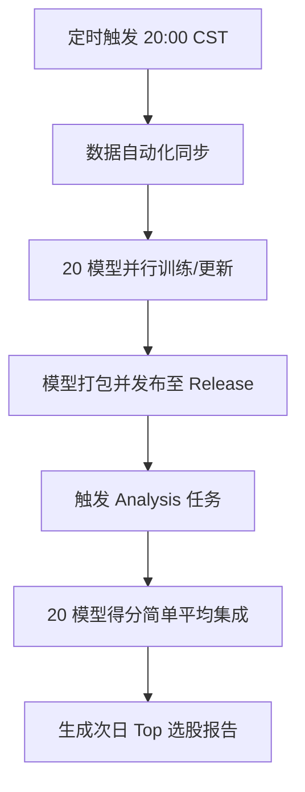

# IMPORTANT
项目声明：本项目初衷为作者自用的量化脚本，目前正处于从“个人工具”向“开源项目”过渡的完善与规范阶段。

🚀 先看结果：如果你想直接查看工具的实战表现，可以访问由 GitHub Action 每日自动生成的预测报告： 👉 查看每日预测结果预览
https://touhoufan2024.github.io/qlibAssistant/

风险提示：量化模型预测仅供参考，不构成任何投资建议。股市有风险，入市需谨慎。

# QlibAssistant

[](https://github.com/touhoufan2024/qlibAssistant/actions/workflows/train.yml)
[](https://github.com/touhoufan2024/qlibAssistant/actions/workflows/analysis.yml)

**QlibAssistant** 是一个基于微软开源量化框架 [Qlib](https://github.com/microsoft/qlib) 构建的辅助工具。它旨在解决 Qlib 使用门槛高、需要大量编写样板代码的问题，通过自动化的工程手段，实现 A 股量化模型的**全自动流水线作业**。

🚀 **核心亮点**：系统每日自动训练并集成 **20 个不同维度**的量化模型，通过多模型集成（Ensemble）生成次日的稳健投资信号。

---

## 🚀 每日预测看板
* **查看实战表现**：👉 [每日预测结果预览](https://touhoufan2024.github.io/qlibAssistant/)
* **下载最新模型**：📦 [GitHub Releases](https://github.com/touhoufan2024/qlibAssistant/releases) (每日更新训练好的模型压缩包)

---

## 🛠️ 自动化流水线架构

本项目利用 GitHub Actions 构建了自动化的量化研究闭环：




### 1. 模型集成方案 (Ensemble Strategy)

为了降低单模型过拟合风险，系统采用了 **4 种算法 × 5 种回溯周期** 的集成架构：

* **基础算法**：`XGBoost`, `LightGBM`, `DoubleEnsemble`, `Linear`
* **训练窗口**：滚动回溯过去 `1年`, `2年`, `3年`, `4年`, `5年` 的历史数据。
* **聚合方式**：对 20 个模型的预测分（Score）取**简单平均**。

### 2. 功能模块

* **数据管理 (`data`)**：自动从上游镜像库同步最新的 A 股分钟/日线数据。
* **模型训练 (`train`)**：支持断点续训，能够自动管理数以百计的模型实验。
* **模型预测 (`model`)**：自动筛选最优模型并执行推理。

---

## 📖 快速上手

### 第一步：准备环境与数据

```bash
pip install -r requirements.txt
# 下载并解压最新的 A 股数据
python roll.py data update

```

### 第二步：模型训练

你可以一键启动大规模训练任务：

```bash
使用 滚动训练 LightGBM 模型, 
cd ./roll && python ./roll.py --pfx_name="EXP" --model_name="LightGBM" --dataset_name="Alpha158" --stock_pool="csi300" --rolling_type="custom" train start_custom

使用 ci 同款训练方式, 训练 20 个模型
cd ./roll && python ../script/run.py

```

### 第三步：生成预测

```bash
# 自动调用最新的 20 个集成模型进行推理
python ./roll.py model selection

```

---

## 📊 预测逻辑说明

* **目标 (Label)**：预测 T 日收盘后，**T+1 日开盘买入** 到 **T+2 日收盘卖出** 的期望收益率。
* **风险提示**：量化模型预测仅供参考，不考虑 A 股涨跌停机制，不构成投资建议。

---

## 🤝 贡献与反馈

如果你有更好的因子建议或模型优化方案，欢迎提交 Issue 或 Pull Request！

---

## 交流群

### Telegram 群


